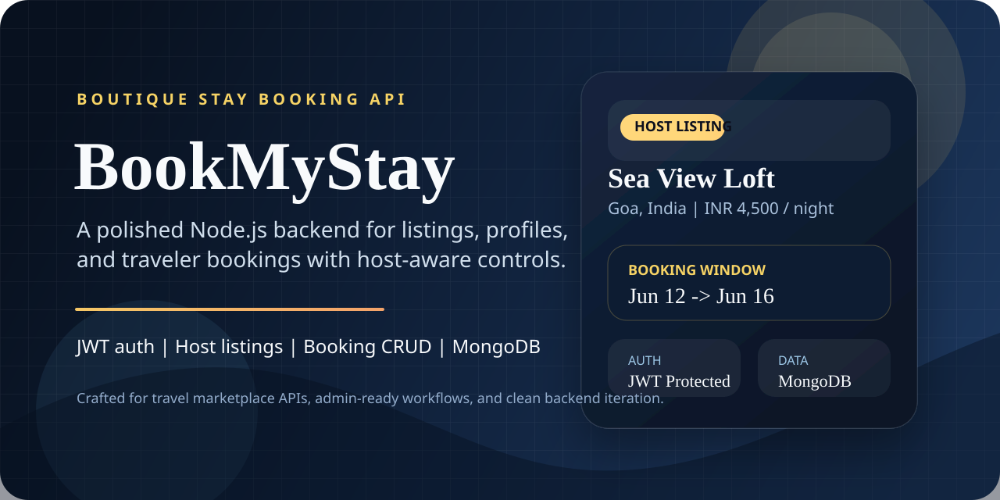

<p align="center">
  
</p>

<h1 align="center">BookMyStay</h1>

<p align="center">
  A backend-first stay booking platform for hosts and travelers, built with Express, MongoDB, JWT authentication, and protected booking flows.
</p>

<p align="center">
  
  
  
  
</p>

## Overview

BookMyStay is a REST API for managing user accounts, traveler profiles, host listings, and booking operations. The project is currently backend-focused, with authenticated routes for profile and booking management plus host-only listing controls.

## What It Covers

- Secure authentication with hashed passwords and JWT-based sessions.
- Automatic profile bootstrap for newly registered users.
- Public listing discovery with location and price filters.
- Host-controlled listing creation, updates, deletion, and personal listing lookup.
- Protected booking CRUD with ownership checks on read, update, and delete.
- MongoDB data modeling with Mongoose.

## Tech Stack

| Layer | Tools |
| --- | --- |
| Runtime | Node.js |
| Server | Express 5 |
| Database | MongoDB |
| ODM | Mongoose |
| Auth | JWT, bcryptjs |
| Dev Workflow | nodemon, dotenv, CORS |

## API Snapshot

| Method | Route | Access | Purpose |
| --- | --- | --- | --- |
| `POST` | `/api/auth/register` | Public | Create a user and starter profile |
| `POST` | `/api/auth/login` | Public | Sign in and receive a JWT |
| `GET` | `/api/profile` | Bearer token | Get the logged-in user's profile |
| `POST` | `/api/profile` | Bearer token | Create a profile for the logged-in user |
| `PUT` | `/api/profile` | Bearer token | Update the logged-in user's profile |
| `DELETE` | `/api/profile` | Bearer token | Delete the logged-in user's profile |
| `GET` | `/api/listing` | Public | Browse listings with optional filters |
| `GET` | `/api/listing/:id` | Public | Fetch a single listing |
| `GET` | `/api/listing/my-listing` | Bearer token | Fetch listings created by the logged-in host |
| `POST` | `/api/listing` | Bearer token | Create a listing as a host |
| `PUT` | `/api/listing/:id` | Bearer token | Update a host-owned listing |
| `DELETE` | `/api/listing/:id` | Bearer token | Delete a host-owned listing |
| `POST` | `/api/booking` | Bearer token | Create a booking |
| `GET` | `/api/booking/my-bookings` | Bearer token | Fetch all bookings for the logged-in user |
| `GET` | `/api/booking/:id` | Bearer token | Fetch one owned booking |
| `PUT` | `/api/booking/:id` | Bearer token | Update one owned booking |
| `DELETE` | `/api/booking/:id` | Bearer token | Delete one owned booking |

## Quick Start

1. Install dependencies.

```bash
npm install
```

2. Create a `.env` file using `.env.example`.

3. Start the API in development mode.

```bash
npm run dev
```

4. The server will run on `http://localhost:3000` when `PORT=3000`.

## Environment Variables

```env
PORT=3000
MONGO_URI=mongodb://127.0.0.1:27017/bookmystay
JWT_SECRET=replace_with_a_strong_secret
```

## Example Booking Request

```bash
curl.exe -X POST "http://localhost:3000/api/booking" ^
  -H "Content-Type: application/json" ^
  -H "Authorization: Bearer <JWT_TOKEN>" ^
  -d "{\"listingId\":\"6650f1f3c8e4d8a1b2c3d4e5\",\"checkIn\":\"2026-06-01T12:00:00.000Z\",\"checkOut\":\"2026-06-05T11:00:00.000Z\"}"
```

## Project Structure

```txt
BookMyStay/
|-- server.js
|-- package.json
|-- readme-banner.svg
|-- src/
|   |-- app.js
|   |-- controllers/
|   |-- db/
|   |-- middlewares/
|   |-- models/
|   |-- routes/
```

## Current Direction

This repository already covers the core API building blocks for a stay-booking platform. Strong next steps would be request validation, booking date conflict checks, automated tests, and media upload support for listing images and avatars.
